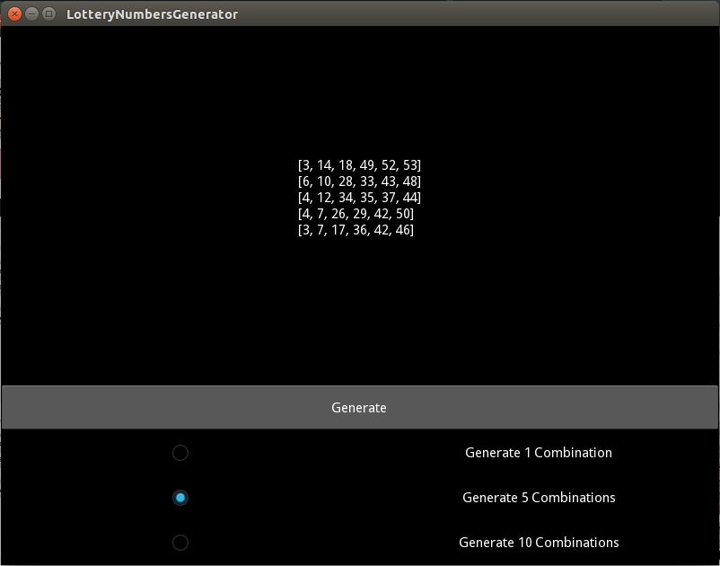

# Lottery Numbers Generator

## About

### Short Description
This program is generates 6 random numbers

### The Problem
You have 1 in 28,989,675 chance of winning the lottery (Philippine Lottery). How can we improve the chance of winning in the lottery?

### The Solution
Making a program that eliminates rare combinations by setting some rules. Examples of rare combinations:

- [1, 2, 3, 4, 5, 6]
- [2, 4, 6, 8, 10, 12]
- [1, 3, 5, 7, 9, 11, 13]
- [1, 2, 3, 4, 5, 7]
- etc.

### The Rules
1. It should generate 6 random numbers from 1-55
2. It should generate numbers from Low (1-28) and High (29-55) with this ratios:

        3:3  4:2  2:4

3. It should generate Odd and Even numbers with the same ratio as above
4. It should not generate 6 numbers from all of 5 groups
5. The sum of the 6 numbers should be from 104 - 239
6. Every list should not be generated twice or more (Not working on this version)

## How to Run
This program runs on [Kivy](kivy.org) - A Cross-platform Python Framework. To install Kivy on your machine, please follow the instructions at the [Kivy Documentation](http://kivy.org/docs/gettingstarted/installation.html)

## Screenshots

## Contact

You can contact me at [austingimperial(AT)gmail(DOT)com](mailto:austingimperial@gmail.com)

## Release Notes

- **V1.0**: First released version